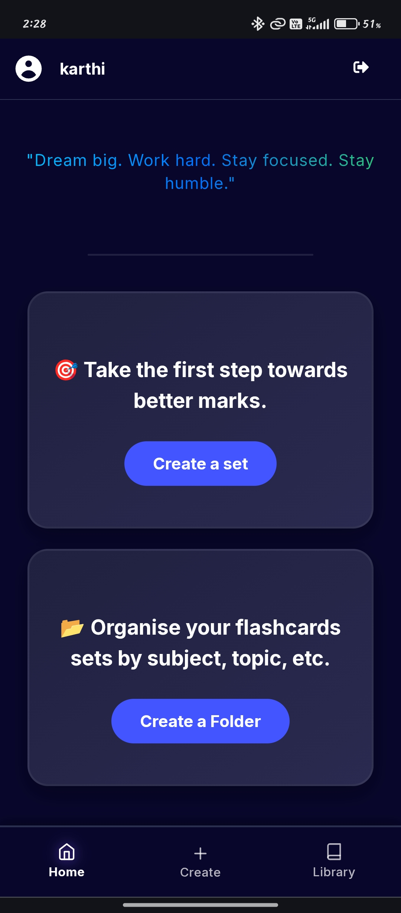
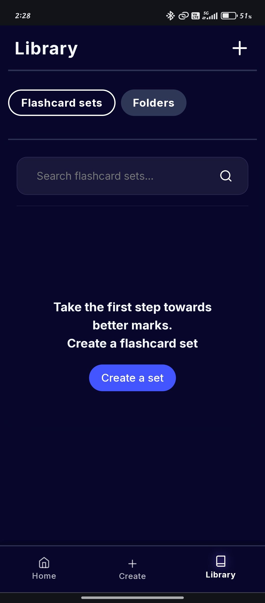
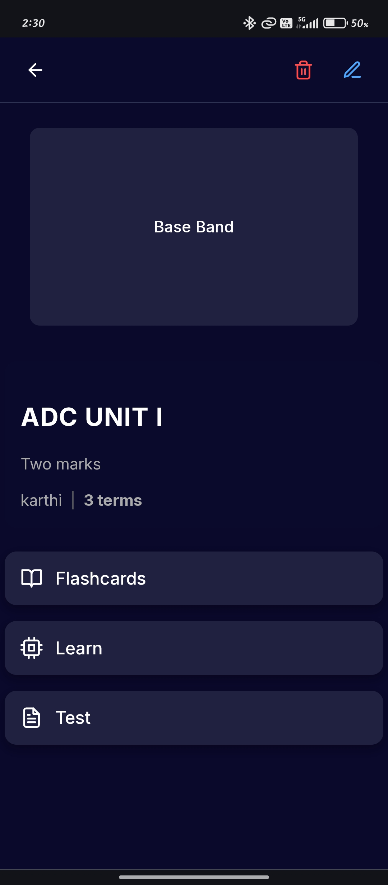
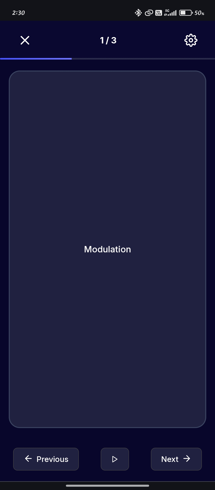
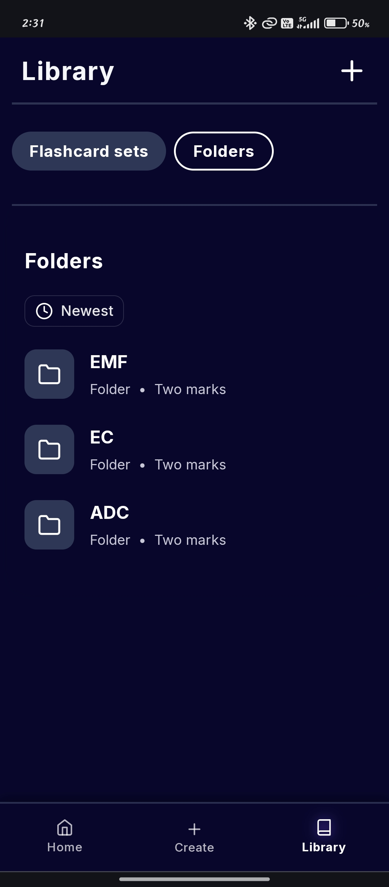

# 📘 Flashido – Learn Smarter, Anywhere 🚀

> Are you struggling to **remember complex formulas**? 🤯  
> Are you a **language learner**?  
> Want to **practice new languages** without carrying bulky notes? 🌍  
> Need a **last-minute exam prep tool** that works anywhere? ⏳  

✨ **Welcome to Flashido** — your all-in-one ***free*** learning & productivity app.  
With smart **flashcards**, **folders**, and powerful study features, Flashido helps you **learn smarter, not harder**.  

---

## ✨ Features

- 🧮 **Markdown + LaTeX Support** – Write equations, formulas, and notes beautifully.  
- 🌍 **Language Learning Friendly** – Practice vocabularies, phrases, and meanings.  
- 🔄 **Auto-Flip Cards** – Cards flip automatically and move to the next card.  
- 📂 **Organize Flashcards** – Group sets into folders for easy navigation.  
- 🎯 **Quick Revision** – Perfect for last-minute exam prep.  
- 🔥 **Infinite Scroll** – Flip through cards seamlessly.  
- ⚡ **More Features to Explore** – Random quotes, smart sorting, and more.  

---

## 🖼️ Screenshots

<table>
<tr>
  <td></td>
  <td></td>
  <td></td>
  <td></td>
  <td></td>
</tr>
</table>

---

## 📖 Use Cases

- ✍️ Write math/science **equations with LaTeX**  
- 🌍 Learn new words in **Spanish, French, Japanese, etc.**  
- 🧪 Memorize **biology definitions, historical dates, or key concepts**  
- ⏳ Last-minute exam **revision with auto-flip cards**  

---

## 🛠️ Tech Stack

- **Frontend:** React + Vite  
- **Backend:** Firebase Firestore  
- **UI/UX:** TailwindCSS + shadcn/ui + lucide-react  
- **State Management:** React Context API  
- **Hosting:** Firebase Hosting / Vercel  

---

## 📂 Project Structure

```
└── 📁src
    └── 📁assets
        ├── image.png
        ├── logo.svg
        ├── react.svg
    └── 📁components
        └── 📁buttons
            ├── AddCardButton.jsx
            ├── plus_floating_btn.jsx
            ├── PopupModal.jsx
            ├── toggle_btn.jsx
        └── 📁flashcard
            ├── card_grid.jsx
            ├── Card.jsx
            ├── CardInput.jsx
            ├── flashcard_page_header.jsx
            ├── TermDefinitionList.jsx
            ├── TitleInput.jsx
            ├── TopBar.jsx
        └── 📁folder
            ├── CreateFolder.jsx
            ├── folder_grid.jsx
            ├── folder_page_header.jsx
            ├── ThreeDotMenu.jsx
        └── 📁home
            ├── bottom_nav.jsx
            ├── bottom_sheet.jsx
            ├── header.jsx
            ├── log_out.jsx
        └── 📁library
            ├── Library_header.jsx
            ├── search_bar.jsx
            ├── SearchInput.jsx
        ├── create.jsx
        ├── flashcards.jsx
        ├── folders.jsx
        ├── loading_spinner.jsx
        ├── progress.jsx
    └── 📁context
        ├── app_data.jsx
        ├── auth_context.jsx
    └── 📁features
        ├── auto_equations.jsx
    └── 📁pages
        └── 📁flashcard
            ├── create_set.jsx
            ├── flashcard_page.jsx
            ├── flashcards_flip.jsx
            ├── get_sets.jsx
            ├── learn.jsx
        └── 📁folder
            ├── folder_page.jsx
        └── 📁home
            ├── home_folder_list.jsx
            ├── home_page.jsx
            ├── home_set_list.jsx
        └── 📁library
            ├── classes.jsx
            ├── library_page.jsx
        └── 📁user
            ├── login_page.jsx
            ├── signup_page.jsx
            ├── username_page.jsx.back
            ├── username_popup.jsx
        ├── test.jsx
    └── 📁services
        ├── flashcards.service.js
        ├── folders.services.js
        ├── private_route.jsx
        ├── storage.service.js
    └── 📁styles
        └── 📁components
            ├── AddCardButton.css
            ├── bottom_navbar.css
            ├── bottom_sheet.css
            ├── card_grid.css
            ├── CardInput.css
            ├── create_folder.css
            ├── flash_card_list.css
            ├── flashcard_page_header.css
            ├── flip_card.css
            ├── folder_grid.css
            ├── folder_list_horizontal.css
            ├── folder_page_header.css
            ├── full_flip_card.css
            ├── header.css
            ├── library_header.css
            ├── list_cards.css
            ├── list_folders.css
            ├── loading_spinner.css
            ├── popup.css
            ├── search_bar.css
            ├── set_list_horizontal.css
            ├── TermDefinitionList.css
            ├── TitleInput.css
            ├── toggle_btn.css
            ├── TopBar.css
        └── 📁pages
            ├── create_folder.css
            ├── create_set.css
            ├── flashcard_page.css
            ├── flashcard.css
            ├── flashcards_flip.css
            ├── folder_page.css
            ├── get_sets.css
            ├── home_page.css
            ├── library_page.css
            ├── login_page.css
            ├── username_popup.css
    └── 📁utils
        ├── add_delete_sets_from_folder.js
        ├── delete_folder.jsx
        ├── deleteSetFromDatabase.js
        ├── fetch_cards.jsx
        ├── fetch_public_sets.js
        ├── fetch_public_sets.jsx
        ├── FlashcardList.jsx
        ├── list_cards.jsx
        ├── list_folders.jsx
        ├── PageWrapper.jsx
        ├── pushToPublic.jsx
        ├── RandomQuotes.jsx
    ├── App copy.css
    ├── App copy.jsx
    ├── App.css
    ├── App.jsx
    ├── firebase.js
    ├── index copy.css
    ├── index.css
    ├── main copy.jsx
    └── main.jsx
```

---

## 🚀 Getting Started
1. Clone the repo
```
git clone https://github.com/your-username/flashido.git
cd flashido
```

2. Install dependencies
```
npm install
```
3. Setup Firebase

- Go to Firebase Console

- Create a new project

- Add Firestore Database

- Copy config into src/firebase.js

- 4. Run the app
```
npm run dev
```

---


## 🛣️ Future Plans / Roadmap

- 📚 GCR (Google Classroom) Integration – Sync class notes & assignments.

- 📝 To-Do List & Journal – Keep track of tasks & personal notes.

- 🔔 Notifications & Reminders – Never miss a study session.

- 🌐 Multi-language Support – Expand language learning options.

- 💡 Smart Study Recommendations – Suggest flashcards based on your performance.


---

## 🤝 Contributing

- Fork the project

- Create your feature branch (git checkout -b feature/AmazingFeature)

- Commit your changes (git commit -m "Add AmazingFeature")

- Push to the branch (git push origin feature/AmazingFeature)

- Open a Pull Request
